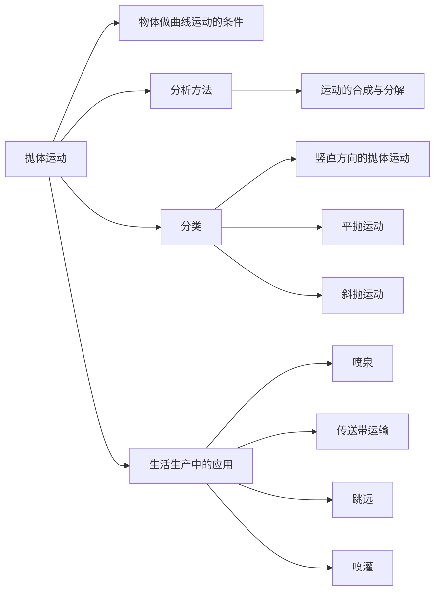

# 抛体运动

```mermaid
graph LR
抛体运动 --> 1[物体做曲线运动的条件] & way[分析方法] & kind[分类] & 2[生活生产中的应用]
2 --> 喷泉 & 传送带运输 & 跳远 & 喷灌
way --> 3[运动的合成与分解]
kind --> 4[竖直方向的抛体运动] & 5[平抛运动] & 6[斜抛运动]
click 1 "../2.1.1"
click 3 "../2.1.2"
click 5 "../2.1.4"
click 4 "../2.1.6"
click 6 "../2.1.5"
```
