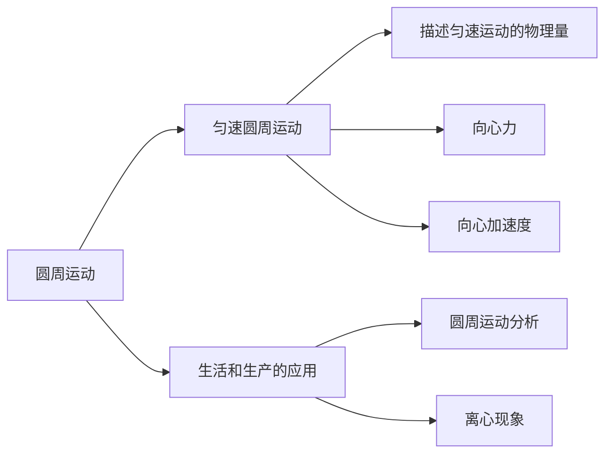

# 圆周运动

```mermaid
graph LR
1[圆周运动] --> 2.1[匀速圆周运动] & 2.2[生活和生产的应用]
2.1 --> 2[描述匀速运动的物理量] & 3[向心力] & 4[向心加速度]
2.2 --> 5[圆周运动分析] & 6[离心现象]
click 2.1 "../2.2.1"
click 2 "../2.2.1"
click 3 "../2.2.2.1"
click 4 "../2.2.2.2"
click 5 "../2.2.4"
click 6 "../2.2.3"
```
