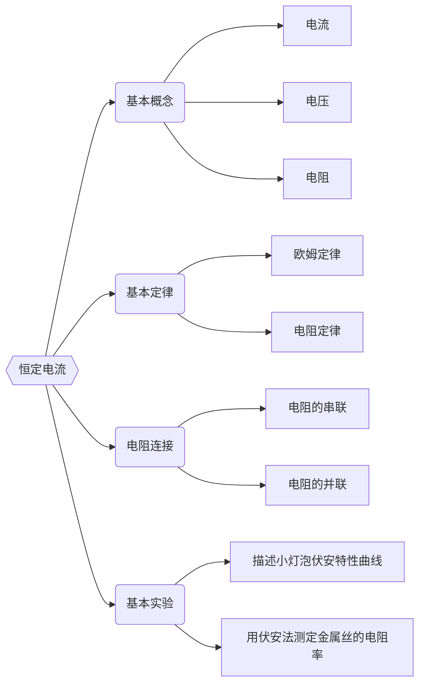

# 恒定电流

```mermaid
graph LR
0{{恒定电流}} --> 1(基本概念) & 2(基本定律) & 3(电阻连接) & 4(基本实验)
1 --> 电流 & 电压 & 电阻
2 --> 欧姆定律 & 电阻定律
3 --> 电阻的串联 & 电阻的并联
4 --> 描述小灯泡伏安特性曲线 & 用伏安法测定金属丝的电阻率
click 1 "./3.3.1"
click 2 "./3.3.2"
click 3 "./3.3.3"
click 4 "./3.3.4"
```