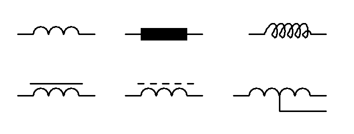

# 认识电路元器件

- [ ] 什么是电路元器件？
- [ ] 常见的电路元器件有哪些？

## 什么是电路元器件

电路元器件是构成电路的元[^whatisyuan]器件，无源器件[^whatispassivedevice]和集成电路可以用作电路元器件。

[^whatisyuan]: “元”始见于商代甲骨文及商代金文，其古字形像头部突出的侧立的人形，本义即人头。头位居人体最高处，而且功能非常重要，因此引申表示首要的、第一的。也用来表示天地万物的本源，含有根本的意思。
[^whatispassivedevice]: 无源器件是指在不需要外加电源的条件下，就可以显示其特性的电子元件。电阻器、电容器和电容器都是无源器件。

- [ ] ==电路元器件是构成电路的元器件==
- [ ] 常见的电路元器件有哪些？

## 电路元器件有哪些

### 电阻器

!!! Note inline end "定值电阻和可变电阻"
    
      

电阻器是阻值相对稳定或可控的物体。常见的电阻器有：

- 碳膜电阻
- 绕线电阻
- 熔断电阻
- 电位器
- 滑动变阻器
- 电阻箱

电阻器的符号是 $R$ ，电路符号如右图所示。

### 电感器

!!! Note inline end "电感器在各种情况下的电路符号"
      

电感器是通过**电磁感应**[^jump1]将外部电路的电能转换为内部磁场的物体，一般是由金属丝绕成的线圈，可以插入铁芯。

[^jump1]: 见

电感器的符号是 $L$ ，电路符号如右图所示。

### 二极管

!!! Note inline end "二极管的电路符号，及其与实物的对照"
    

二极管是只允许电流从单个方向流过的物体。常见的二极管有：

- 稳压二极管
- 变容二极管
- 开关二极管
- 发光二极管
- 检波二极管

二极管的符号是 $D$ ，电路符号如右图所示。

- [ ] 电路元器件是构成电路的元器件
- [ ] ==常见的电路元器件有电阻器、电感器和二极管==
