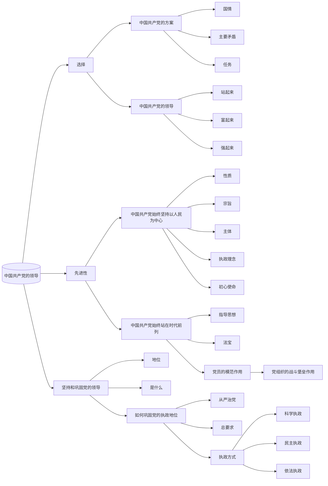

# 中国共产党的领导

本单元，我们要理解中国共产党为什么会**建立和领导**新中国，而不是其他的政党或团体；中国在中国共产党的领导下得到了哪些**巨大的发展**；中国的**过去、现在和未来**为什么都要靠中国共产党来领导，以及如何**坚持和加强**这一点。

```mermaid
graph LR
1[(中国共产党的领导)] --> choose[选择] & way[先进性] & 1.1[坚持和巩固党的领导]
choose --> 中国共产党的方案 --> 国情 & 主要矛盾 & 任务
choose --> 中国共产党的领导 --> aa[站起来] & bb[富起来] & cc[强起来]
way --> aaa[中国共产党始终坚持以人民为中心] --> 性质 & 宗旨 & 主体 & 执政理念 & 初心使命
way --> bbb[中国共产党始终站在时代前列] --> 指导思想 & 法宝 & bbbb[党员的模范作用]
bbbb --> 党组织的战斗堡垒作用
1.1 --> place[地位] & 是什么 & cccc[如何巩固党的执政地位]
cccc --> 从严治党 & 总要求 & wayy[执政方式]
wayy --> 科学执政 & 民主执政 & 依法执政
```
