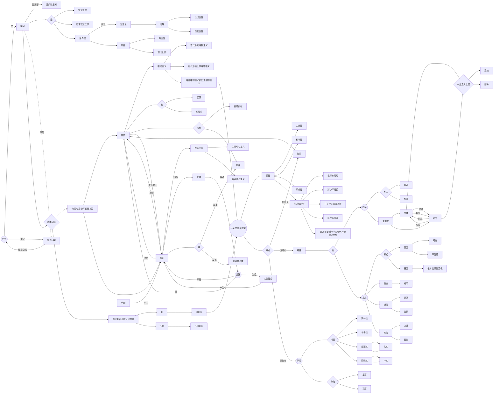

## 探究世界的本质

### 把握世界的规律

既然我们已经知道了运动是有规律的，那么这些规律是什么，又该如何把握规律呢？

#### 世界是普遍联系的

关于**联系**，有一下几个基本事实：

- **任何事物都与周围其它事物有这这样或那样的联系，没有一个事物是孤立存在的**
- **联系是客观的，是事物本身所共有的，不为人的意志为转移**
- **联系是多种多样的，例如**：直接与间接，内部与外部，本质与非本质，必然与偶然

善于分析和把握事物存在和发展的各种条件，才能正确的认识和改造世界。

#### 用联系的观点看问题

用联系的观点看问题，关键是要正确认识和处理整体和部分的辩证关系，掌握系统优化的方法。

- **整体和部分是相互区别的**

整体居于主导地位，整体统帅着部分。

部分处于被支配地位，服从和服务于整体。

- **整体和部分是相互联系、密不可分的**

整体离开了部分就不存在，部分的变化影响了整体的功能。

有整体才有所谓的部分。

!!! Note "系统与要素"
    系统是相互联系和相互作用的诸要素构成的统一整体。

    系统的特征是整体性、有序性以及其优化方向是对于自生内部结构的

我们要用全局的、综合的思维方式来认识事物，掌握优化系统的方法。
    
#### 世界是永恒发展的

**世界处于永恒运动、变化、发展的过程中，例如**：

- 低级→高级 简单→复杂 资本主义→共产主义

**新事物必然战胜就事物**

- 新事物：符合客观规律、具有强大的生命力和远大的发展前途

- 旧事物：违背事物发展的必然趋势，必然灭亡

#### 用发展的观点看问题

量变：数量的增减，场所的变更

质变：根本性质的变化

### 唯物辩证法的实质与核心

#### 事物发展的源泉的动力 —— 矛盾

世界上的一切事物都包含着既对立又统一的两个方面，也就是矛盾。

矛盾就是对立与统一。其中，对立是斗争性，统一是同一性。

!!! Example
    道家学说的代表老子说：有无相生，难易相成，长短相形，高下相倾，应声相和，前后相随。

**同一性**：

- 都处在一个统一体中：相互依赖，互为前提
- 都可以在一定条件下相互转化：相互渗透，相互包含

**斗争性**：

- 都有相互分离的倾向和趋势：相互排斥，相互对立

同一性是相对的，斗争性是绝对的。没有斗争性就没有同一性。

