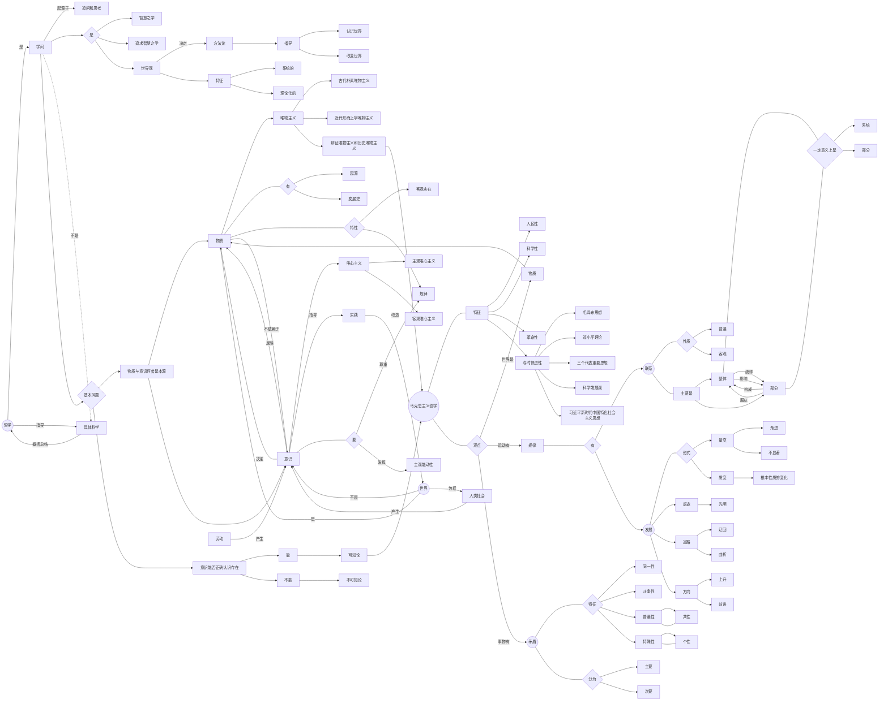

```mermaid
graph LR
pol((哲学)) -->|是| tech[学问]
pol -->|指导| a
tech -->|起源于| 追问和思考
tech --> techis{是}
techis --> 智慧之学 & 追求智慧之学 & worldview[世界观]
tech -.->|不是| a[具体科学] -->|概括总结| pol
tech --> qus{基本问题} --> source[物质与意识何者是本源] & ifknow[意识能否正确认识存在]
worldview -->|决定| way[方法论]
worldview --> worldt[特征] --> 系统的 & 理论化的
way --> teach[指导] --> know[认识世界] & change[改变世界]
source --> thing[物质是本源] & think[意识是本源]
thing --> otg[唯物主义]
think --> otk[唯心主义]
otg --> otg1[古代朴素唯物主义] & otg2[近代形而上学唯物主义] & otg3[辩证唯物主义和历史唯物主义]
otk --> 主观唯心主义 & 客观唯心主义
otg3 --> mks(马克思主义哲学)
ifknow --> ifknowcan[能] & ifknowcant[不能]
ifknowcan --> ifknowcan2[可知论]
ifknowcant --> ifknowcant2[不可知论]
ifknowcan2 --> mks
mks((马克思主义哲学)) --- mkst[特征] --> people[人民性] & seci[科学性] & rev[革命性] & ftime[与时俱进性]
mks --- mkss{观点}
mkss -->|世界是| 物质 --> thing
mkss -->|运动有| law[规律] --- lawhave{有} --> connect & deve
mkss -->|事物有| conflict
ftime --> 毛泽东思想 & 邓小平理论 & 三个代表重要思想 & 科学发展观 & 习近平新时代中国特色社会主义思想
world((世界)) -->|是| thing[物质]
world -->|不是| think[意识]
world -->|包括| soci[人类社会] -->|产生| think
劳动 -->|产生| think
thing --- thinghave{有} --> 起源 & 发展史
thing --- thingt{特性} --> 客观实在 & reg[规律]
think -->|反映| thing -->|不依赖于| think -->|决定| thing
think -->|指导| do[实践] -->|改造| world
think --- thinkneed{要} -->|尊重| reg
thinkneed -->|发挥| 主观能动性
connect((联系)) --- connectt{性质} & connectd[主要是]
connectt --> 普遍 & 客观
connectd --> all[整体] & part[部分] --- connectis{一定意义上是} --> 系统 & 部分
all -->|统帅| part -->|构成| all -->|影响| part -->|服从| all
deve((发展)) --- devex{形式} --> deve1[量变] & deve2[质变]
deve --> 前途 --> 光明
deve --> 道路 --> 迂回 & 曲折
deve --> 方向 --> 上升 & 前进
deve1 --> 渐进 & 不显著
deve2 --> 根本性质的变化
conflict((矛盾)) --- conflictt{特征} --> same[同一性] & flight[斗争性] & common[普遍性] & spec[特殊性]
common --> 共性
spec --> 个性
conflict --- conflictd{分为} --> main[主要] & other[次要]
common --- 共性
spec --- 个性
```
