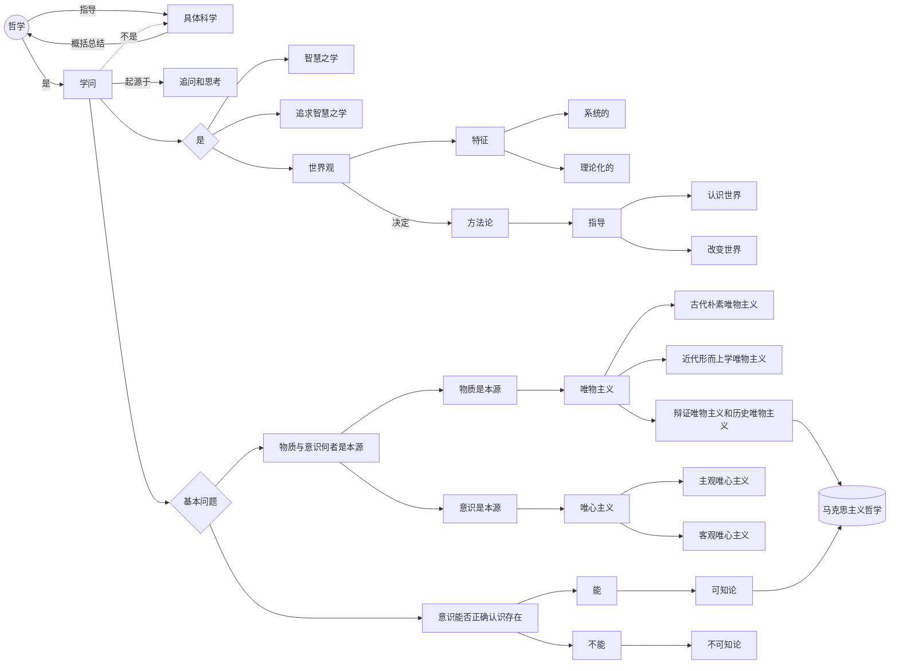

# 哲学是追求智慧的学问

“哲”，即智慧。哲学是**智慧**之学和**追求智慧**之学。

## 哲学的起源

人们在**生活实践**中对宇宙和人生的**追问**和**思考**。

## 哲学的影响

**直接或间接地**影响着我们的学习工作生活。

## 哲学与世界观

哲学是**系统化**和**理论化**的世界观。

## 哲学与方法论

**有什么样的世界观就有什么样的方法论。** 方法论指导人去认识和改造世界。

## 哲学与具体科学

哲学对**具体科学**进行概括和升华。抽象出最一般的本质和最一般的规律。

哲学为具体科学提供**世界观**和**方法论**的指导。

## 哲学的基本问题

**思维**与**存在**（意识与物质）：

- 何者是本源？（谁决定谁？）
- 二者有没有同一性？（意识能否正确认识存在？）

### 唯物主义的形态

- 古代朴素唯物主义（物质混同于物质的具体形态）
- 近代形而上学唯物主义（物质结构混同于物质概念）
- **辩证唯物主义与历史唯物主义**（**科学的**马克思主义哲学）

### 唯心主义的形态

- 主观唯心主义（世界依赖与人的精神）
- 客观唯心主义（世界依赖于客观精神，如神、理念）

