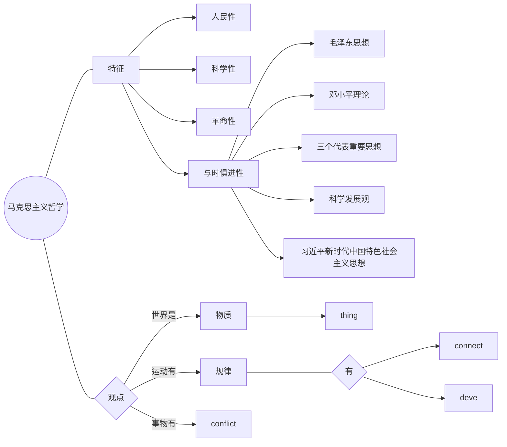

# 认识马克思主义哲学

马克思主义哲学的独特理论品质是**与时俱进**。

## 人民性

站在人民立场，目标实现人类解放。

## 科学性 革命性

揭示了世界的本质与运行规律。

## 马克思主义的中国化

- 毛泽东思想
- 邓小平理论
- 三个代表重要思想
- 科学发展观
- 习近平新时代中国特色社会主义思想

```mermaid
graph LR
mks((马克思主义哲学)) --- mkst[特征] --> people[人民性] & seci[科学性] & rev[革命性] & ftime[与时俱进性]
mks --- mkss{观点}
mkss -->|世界是| 物质 --> thing
mkss -->|运动有| law[规律] --- lawhave{有} --> connect & deve
mkss -->|事物有| conflict
ftime --> 毛泽东思想 & 邓小平理论 & 三个代表重要思想 & 科学发展观 & 习近平新时代中国特色社会主义思想
```
