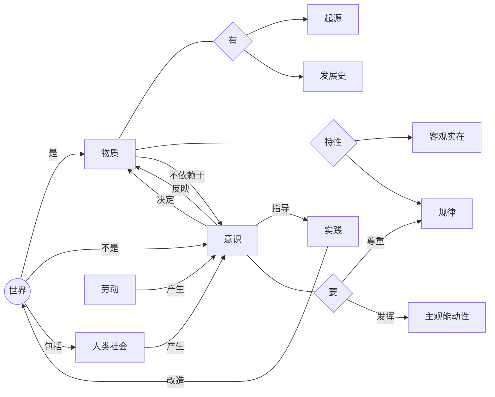

# 世界是物质的

世界是物质的世界，世界的真正统一性在于他的物质性。

## 自然界是物质的

物质具有：

- 先在性
- 客观实在性 ← **唯一特性**

## 人类社会是物质的

人类是从古猿**发展**来的，人类社会和人都是不断**发展**的。

人类社会本质是客观的物质体系。

## 物质产生意识

- **意识是人脑对客观存在主观反映。** 只有人有意识，动物或人工智能没有意识。
- **意识仅仅是物质的派生物。** 物质的长期发展产生了意识，原本没有意识。
- **物质决定了意识，** 意识不能决定物质。

