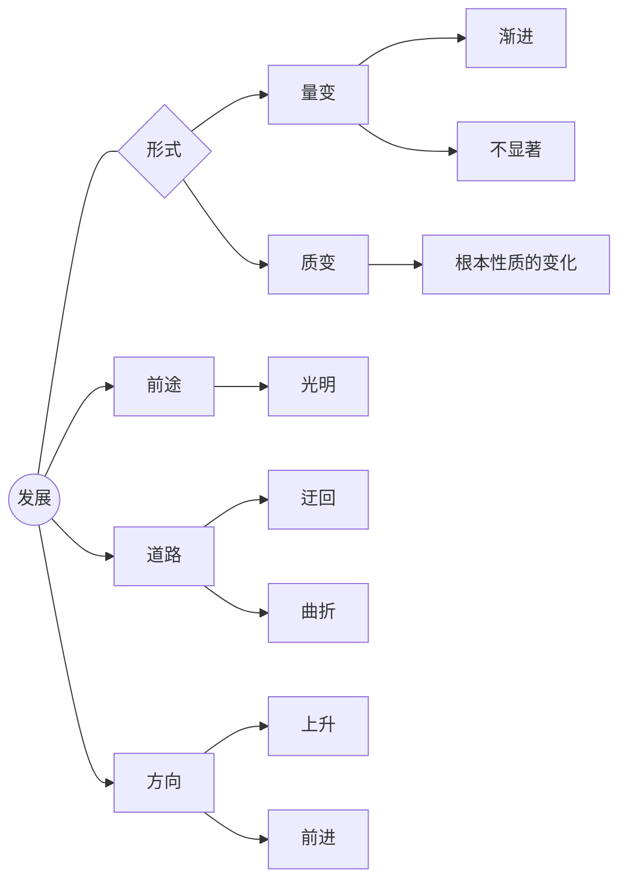

# 马克思主义哲学认为世界是发展的

世界处于永恒运动中。

- 低级 → 高级
- 简单 → 复杂
- 资本主义 → 共产主义

## 新事物必然战胜就事物

- 新事物：符合客观规律、具有强大的生命力和远大的发展前途
- 旧事物：违背事物发展的必然趋势，必然灭亡

## 用发展的观点看问题

- 量变：数量的增减，场所的变更
- 质变：根本性质的变化

```mermaid
graph LR
deve((发展)) --- devex{形式} --> deve1[量变] & deve2[质变]
deve --> 前途 --> 光明
deve --> 道路 --> 迂回 & 曲折
deve --> 方向 --> 上升 & 前进
deve1 --> 渐进 & 不显著
deve2 --> 根本性质的变化
```